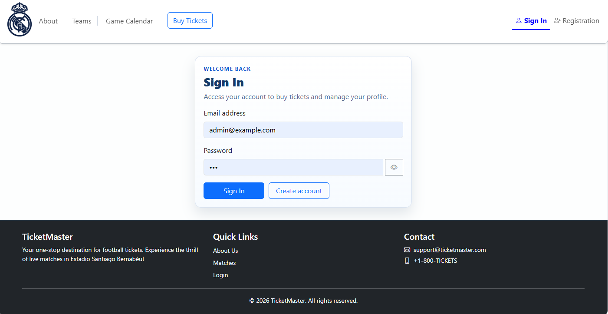
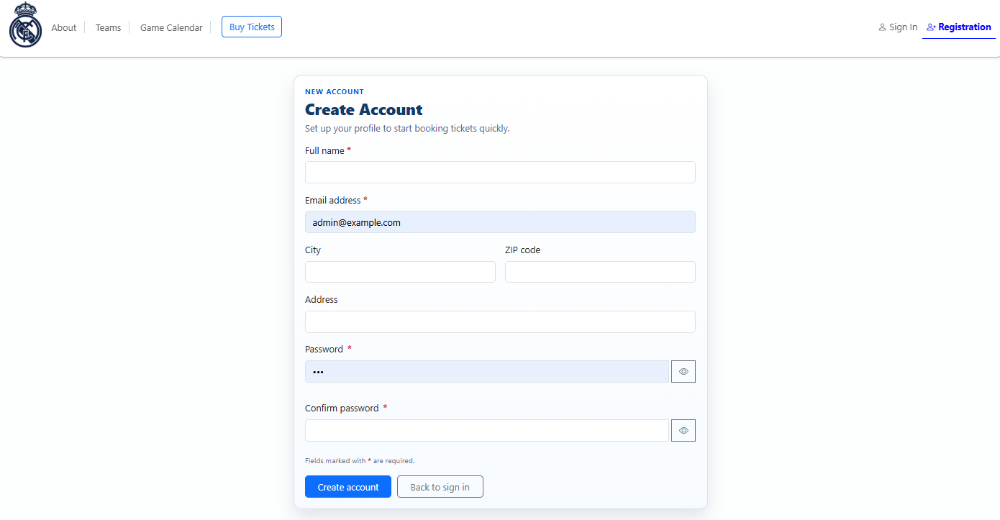
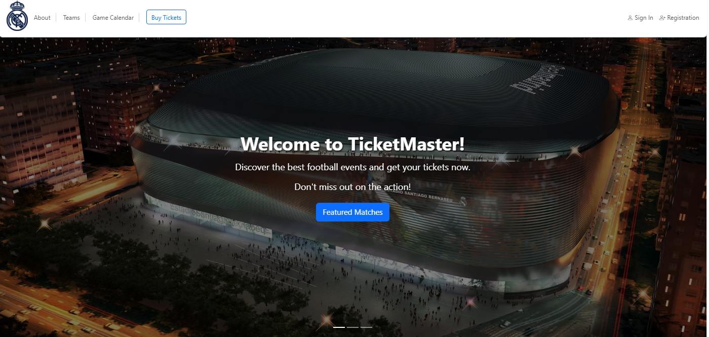
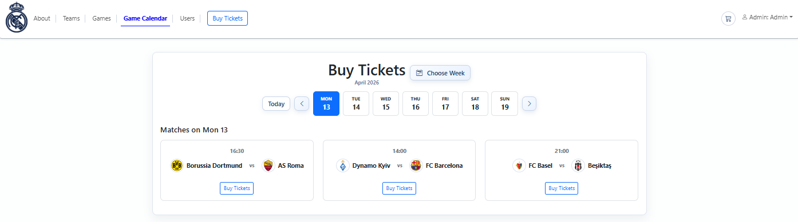
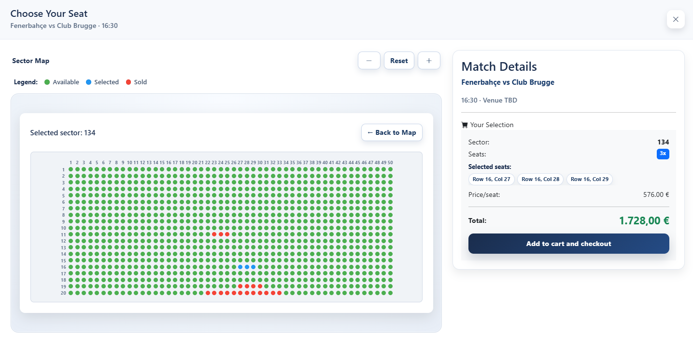
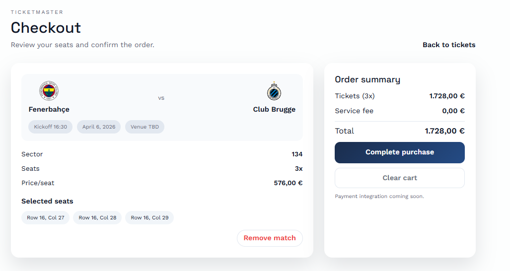
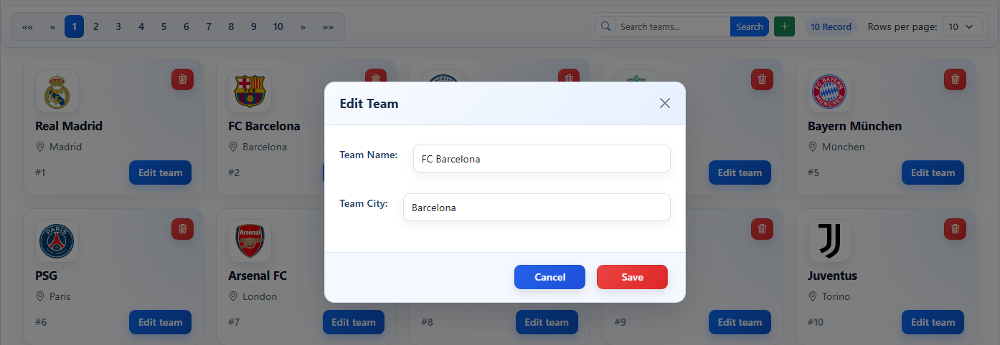
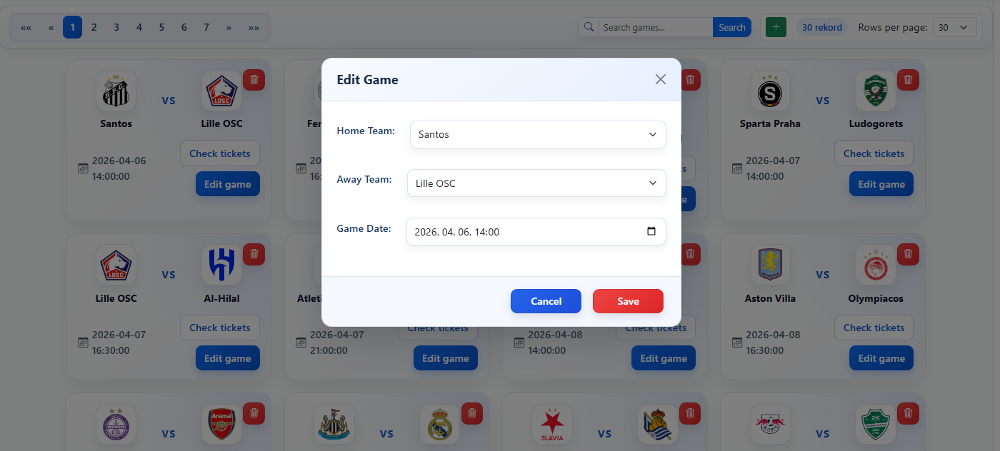
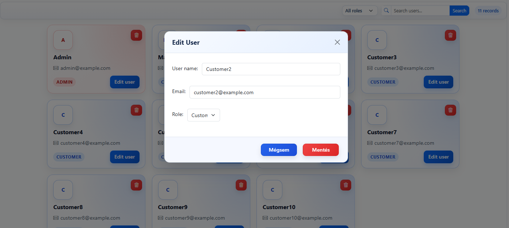

# Jegyfoglaló – Dokumentáció

## A szoftver célja
A rendszer célja focimeccsekre szóló jegyek foglalása és kezelése. A felhasználók böngészhetik a mérkőzéseket, kiválaszthatják a szektorokat és székeket, majd foglalhatnak vagy vásárolhatnak. Az admin jogosultsággal rendelkező felhasználók csapatokat, mérkőzéseket, felhasználókat és kapcsolódó adatokat kezelhetnek.

A projekt két nagy komponensből áll:
- Backend: Laravel API (adatkezelés, autentikáció, jogosultság)
- Frontend: Vue 3 + Vite (felhasználói felület)

## Használatának rövid bemutatása (képernyőképekkel)
A képernyőképek helye: `screenshots/` mappa. A dokumentáció a képek hivatkozásait tartalmazza, a konkrét fájlokat kérlek ide tedd.

1. Belépés / Regisztráció  
  


2. Főoldal és naptár  
  


3. Jegyvásárlás folyamata  
  


4. Admin felületek (ha admin vagy)  
  
  


## Komponensek technikai leírása

### Adatbázis
**Technológia, használt szoftverek**
- MySQL vagy MariaDB (a `.env`-ben állítható).
- A projekt rootban elérhető mentés: `AdatbazisBackup.sql`.

**Diagram**
- ``

**Táblák és mezőleírások mezőtípusokkal**
A táblák a Laravel migrációk alapján készültek.

**`users`**
| Mező | Típus | Megjegyzés |
|---|---|---|
| id | BIGINT, PK | auto increment |
| name | VARCHAR | név |
| email | VARCHAR, UNIQUE | egyedi email |
| billing_city | VARCHAR, NULL | számlázási város |
| billing_zip | VARCHAR(20), NULL | irányítószám |
| billing_address | VARCHAR, NULL | cím |
| role | INT, DEFAULT 3 | jogosultsági szint |
| email_verified_at | TIMESTAMP, NULL | email ellenőrzés |
| password | VARCHAR | jelszó hash |
| remember_token | VARCHAR, NULL | belépéshez |
| created_at | TIMESTAMP | létrehozás |
| updated_at | TIMESTAMP | módosítás |

**`teams`**
| Mező | Típus | Megjegyzés |
|---|---|---|
| id | BIGINT, PK | auto increment |
| team_name | VARCHAR(50) | csapat neve |
| team_city | VARCHAR(50) | város |
| team_logo | VARCHAR(255), NULL | logó URL vagy fájl |

**`games`**
| Mező | Típus | Megjegyzés |
|---|---|---|
| id | BIGINT, PK | auto increment |
| team_home_id | BIGINT, FK | `teams.id` |
| team_away_id | BIGINT, FK | `teams.id` |
| game_date | DATETIME, NULL | meccs időpont |
| UNIQUE | (team_home_id, team_away_id, game_date) | egyediség |

**`sectors`**
| Mező | Típus | Megjegyzés |
|---|---|---|
| id | VARCHAR, PK | szektor azonosító |
| sector_name | VARCHAR, NULL | megjelenített név |
| sector_price | DECIMAL(10,2), NULL | ár |

**`seats`**
| Mező | Típus | Megjegyzés |
|---|---|---|
| id | BIGINT, PK | auto increment |
| sector_id | VARCHAR, FK | `sectors.id` |
| game_id | BIGINT, FK | `games.id` |
| row | INT | sor |
| col | INT | szék |
| status | TINYINT, DEFAULT 0 | 0=szabad |
| UNIQUE | (game_id, sector_id, row, col) | egyediség |

**`tickets`**
| Mező | Típus | Megjegyzés |
|---|---|---|
| id | BIGINT, PK | auto increment |
| user_id | BIGINT, FK | `users.id` |
| game_id | BIGINT, FK | `games.id` |
| seat_id | BIGINT, FK | `seats.id` |
| status | VARCHAR | `reserved`, `paid`, `cancelled` |
| UNIQUE | (game_id, seat_id) | egyediség |

**`personal_access_tokens`**
| Mező | Típus | Megjegyzés |
|---|---|---|
| id | BIGINT, PK | auto increment |
| token | VARCHAR(64), UNIQUE | Sanctum token |
| abilities | TEXT, NULL | jogosultságok |
| expires_at | TIMESTAMP, NULL | lejárat |

**Kapcsolatok röviden**
- Egy `game` két `team`-hez kapcsolódik (home/away).
- Egy `seat` mindig egy adott `game` + `sector` kombinációhoz tartozik.
- Egy `ticket` egy felhasználóhoz, meccshez és székhez kötött.

### Backend
**A technológia**
- Laravel 12 (`server/`), PHP 8.2+
- Auth: Laravel Sanctum (token alapú autentikáció)
- Extra csomagok: `laravel-dompdf`, `simple-qrcode`

**Laravel telepítése (röviden)**
1. `cd server`
2. `composer install`
3. `.env` létrehozása az `.env.example` alapján
4. `php artisan key:generate`
5. `php artisan migrate --seed`
6. `php artisan serve`

**A munkához használt Laravel parancsok**
- `php artisan make:model -m`
- `php artisan make:controller`
- `php artisan make:request`
- `php artisan make:seeder`
- `php artisan make:policy`
- `php artisan migrate --seed`
- `php artisan serve`

**Migráció (mintakód + leírás)**
A `seats` tábla migrációja idegen kulcsokat és összetett egyedi kulcsot használ:

```php
Schema::create('seats', function (Blueprint $table) {
    $table->id();
    $table->string('sector_id');
    $table->foreign('sector_id')->references('id')->on('sectors')->onDelete('cascade');
    $table->foreignId('game_id')->constrained('games')->onDelete('cascade');
    $table->integer('row');
    $table->integer('col');
    $table->tinyInteger('status')->default(0);
    $table->unique(['game_id', 'sector_id', 'row', 'col']);
});
```

**Seeder**
**Forrás adatok (felsorolás)**
- `server/database/data/teams.csv` – csapatnév és város CSV-ben.
- `server/resources/assets/stadium-map.svg` – szektorok azonosítói (SVG `<g id="sector-...">`).
- Faker alapú jegy státusz generálás.
- Admin felhasználó + teszt userek.

**Forrás adatok (minták)**
- `teams.csv`: `TeamName,City`
- `stadium-map.svg`: szektorok `sector-XXX` formában.

**Seeder szerkezete (mintakód)**
A `TeamSeeder` a csapatokat CSV-ből tölti:

```php
$filePath = database_path('data/teams.csv');
$csvData = file($filePath);
foreach ($csvData as $row) {
    $data = str_getcsv($row);
    if (count($data) >= 2) {
        Team::create([
            'team_name' => trim($data[0]),
            'team_city' => trim($data[1]),
        ]);
    }
}
```

**Endpointok**
**MiddleWare: védett tartalmak kezelése**
- `auth:sanctum` védi az API-t.
- `ability:*` képességek a szerepköröket szabályozzák.

Példa admin only útvonal:

```php
Route::get('users', [UserController::class, 'index'])
    ->middleware('auth:sanctum', 'ability:admin');
```

**Endpoint táblázat (részletesebb)**
| Metódus | Útvonal | Védelem | Rövid leírás |
|---|---|---|---|
| POST | `/api/users/login` | publikus | bejelentkezés, token generálás |
| POST | `/api/users/logout` | token | kijelentkezés, token törlés |
| POST | `/api/users` | publikus | regisztráció |
| GET | `/api/users` | admin | összes user |
| GET | `/api/users/{id}` | admin | user lekérdezés |
| PATCH | `/api/users/{id}` | admin | user módosítás |
| DELETE | `/api/users/{id}` | admin | user törlés |
| GET | `/api/usersme` | token | saját profil |
| PATCH | `/api/usersme` | token | saját adatok módosítása |
| PATCH | `/api/usersmeupdatepassword` | token | saját jelszó módosítása |
| DELETE | `/api/usersme` | token | saját profil törlés |
| GET | `/api/teams` | publikus | csapatok listája |
| POST | `/api/teams` | admin | csapat létrehozás |
| PATCH | `/api/teams/{id}` | admin | csapat módosítás |
| DELETE | `/api/teams/{id}` | admin | csapat törlés |
| GET | `/api/games` | publikus | meccsek listája |
| GET | `/api/gamespaging` | publikus | lapozott meccsek |
| POST | `/api/games` | admin | meccs létrehozás |
| PATCH | `/api/games/{id}` | admin | meccs módosítás |
| DELETE | `/api/games/{id}` | admin | meccs törlés |
| GET | `/api/seats` | publikus | székek listája |
| GET | `/api/seats-by-sector` | publikus | szektor szerinti székek |
| POST | `/api/seats-save` | publikus | székek mentése |
| GET | `/api/get-seats` | publikus | székek lekérése |
| GET | `/api/sectors` | publikus | szektorok listája |
| POST | `/api/sectors` | admin | szektor létrehozás |
| PATCH | `/api/sectors/{id}` | admin | szektor módosítás |
| DELETE | `/api/sectors/{id}` | admin | szektor törlés |
| GET | `/api/tickets` | token | jegyek listája |
| POST | `/api/tickets` | token vagy admin | jegy létrehozás |
| PATCH | `/api/tickets/{id}` | token vagy admin | jegy módosítás |
| DELETE | `/api/tickets/{id}` | token vagy admin | jegy törlés |
| POST | `/api/tickets/book` | publikus | foglalás (seat alapján) |

**Request/Response minták**
Az alábbi példák a leggyakrabban használt endpointokra adnak mintát.

**1) Bejelentkezés**

Request:
```http
POST /api/users/login
Content-Type: application/json

{
  "email": "admin@example.com",
  "password": "123"
}
```

Response (200):
```json
{
  "message": "ok",
  "data": {
    "id": 1,
    "name": "Admin",
    "email": "admin@example.com",
    "role": 1,
    "token": "SANCTUM_TOKEN_..."
  }
}
```

**2) Regisztráció**

Request:
```http
POST /api/users
Content-Type: application/json

{
  "name": "Teszt User",
  "email": "teszt@example.com",
  "password": "secret123"
}
```

Response (201):
```json
{
  "message": "ok",
  "data": {
    "id": 12,
    "name": "Teszt User",
    "email": "teszt@example.com",
    "role": 3
  }
}
```

**3) Meccs létrehozás (admin)**

Request:
```http
POST /api/games
Authorization: Bearer <token>
Content-Type: application/json

{
  "team_home_id": 1,
  "team_away_id": 2,
  "game_date": "2026-09-21 19:00:00"
}
```

Response (200):
```json
{
  "message": "OK",
  "data": {
    "id": 55,
    "team_home_id": 1,
    "team_away_id": 2,
    "game_date": "2026-09-21 19:00:00"
  }
}
```

**4) Jegy foglalás (tickets/book)**

Request:
```http
POST /api/tickets/book
Content-Type: application/json

{
  "game_id": 10,
  "seat_ids": [12, 13, 14]
}
```

Response (200):
```json
{
  "message": "OK",
  "data": {
    "game_id": 10,
    "reserved": [12, 13, 14]
  }
}
```

**5) Validációs hiba (422)**

Response (422):
```json
{
  "message": "Validációs hiba történt.",
  "errors": {
    "game_date": ["The game date is required."]
  },
  "data": null
}
```

**Minta kontroller**
A `GameController` validál és betölti a kapcsolt csapatokat:

```php
public function store(StoreGameRequest $request)
{
    return $this->apiResponse(
        fn () => Game::create($request->validated())
    );
}
```

**Minta model**
A `Game` modell kapcsolatai:

```php
public function homeTeam()
{
    return $this->belongsTo(Team::class, 'team_home_id');
}
```

**Minta validáció (422)**
A validációs hibák 422-es státusszal térnek vissza:

```json
{
  "message": "Validációs hiba történt.",
  "errors": {
    "game_date": ["The game date is required."]
  },
  "data": null
}
```

### Autentikáció
- **Be- és kijelentkezés**: `POST /api/users/login`, `POST /api/users/logout`.
- **Token**: Sanctum token 1 napra készül (UserController).
- **Jogosultsági szintek**:
  - `role = 1`: admin
  - `role = 2`: korlátozott (pl. jegykezelés)
  - `role = 3`: alap felhasználó

## Frontend leírás
**Milyen modulok**
- Vue 3, Vite
- Pinia (állapotkezelés)
- Vue Router (útvonalak)
- Axios (API kommunikáció)
- Bootstrap 5 + Bootstrap Icons (UI)

**Oldal szerkezet**
- Belépési pont: `client/src/main.js`
- Gyökér komponens: `client/src/App.vue`
- Menü: `client/src/components/Layout/Menu.vue`

**Jogosultsági rendszer kezelése**
- Backend szinten: `auth:sanctum` + `ability:*` middleware.
- Menü szinten: `Menu.vue` `hasMenuAccess()` metódus.
- Route szinten: `router.beforeEach` ellenőrzés.

**Milyen fájlok (fő mappák)**
- `client/src/api`: Axios kliens + service réteg.
- `client/src/stores`: Pinia store-ok.
- `client/src/components`: UI komponensek.
- `client/src/views`: nézetek/oldalak.
- `client/src/router`: útvonalak és guard.

**Frontend oldalak részletesebben**
- `HomeView.vue`: kezdő oldal, kiemelések és belépési pont a meccsekhez.
- `AboutView.vue`: projekt leírás, bemutatkozás.
- `TeamView.vue`: csapatok listázása, kártyás megjelenítés, admin CRUD.
- `GamesView.vue`: meccsek listája, lapozás és admin műveletek.
- `BuyTicketsView.vue`: meccsnaptár és jegyvásárlási folyamat belépő oldala.
- `CheckoutView.vue`: kosár és megerősítés.
- `UsersView.vue`: admin felhasználókezelés.
- `LoginView.vue` és `RegistrationView.vue`: bejelentkezés és regisztráció.
- `ProfileView.vue`: saját profil és adatok módosítása.
- `404.vue`: nem létező útvonal kezelése.

**Program szerkezet – minták és rövid leírás**
**Kártyák** (Teams nézet):

```vue
<article v-for="team in items" :key="team.id" class="team-card">
  <h3 class="team-card-title">{{ team.team_name }}</h3>
  <p class="team-card-meta">{{ team.team_city }}</p>
</article>
```

**Lapozás**
- `Pagination` komponens + store `getPaging()`.

**Űrlapok és validálás**
- `FormTeam.vue` szerveroldali hibákat fogad (422).

```js
if (err.response && err.response.status === 422) {
  this.$refs.form.setServerErrors(err.response.data.errors);
}
```

**Komponensek**
- Modálok, CRUD gombok, toast üzenetek.

**Dizájn, reszponzivitás**
- Bootstrap grid + saját CSS.
- `@media` töréspontok több komponensben.

## Üzleti folyamat (jegyfoglalás lépései)
Az alábbi lépések a felhasználói jegyfoglalás tipikus menetét írják le:

1. A felhasználó megnyitja a `BuyTicketsView.vue` oldalt.
2. Kiválaszt egy mérkőzést a naptárból (meccslista a `/api/games` végpontról).
3. A rendszer lekéri a szektorokat és székeket a kiválasztott meccshez.
4. A felhasználó kijelöli a kívánt székeket.
5. A kijelölt székek a kosárba kerülnek (`CheckoutView.vue`).
6. A felhasználó megerősíti a foglalást.
7. A backend a `tickets` táblába rögzíti a foglalásokat.
8. A státusz lehet `reserved` vagy `paid` (üzleti logikától függően).

## Adatáramlás (Frontend → Backend → Adatbázis)
Az adatáramlás a következő logika mentén működik:

1. **UI interakció**: a felhasználó egy nézeten (pl. `TeamView.vue`) műveletet végez.
2. **API hívás**: az adott service (`client/src/api/*.js`) Axioson keresztül hívja a backend API-t.
3. **Hitelesítés**: az Axios kliens automatikusan hozzáadja a `Bearer` tokent, ha van bejelentkezett user.
4. **Controller**: a Laravel controller validálja a bemenetet (FormRequest), majd elvégzi az adatbázis műveletet.
5. **Model / DB**: Eloquent model menti vagy lekéri a rekordokat.
6. **Válasz**: JSON válasz érkezik vissza a frontendhez.
7. **State frissítés**: Pinia store frissíti az állapotot, a komponensek újrarenderelnek.

**Példa adatáramlás: csapat létrehozás**
- `TeamView.vue` -> `teamService.js` -> `POST /api/teams`
- `TeamController@store` validál -> `teams` tábla INSERT
- Válasz -> store frissítés -> UI újratöltés

---

## Megjegyzések
- A képernyőképeket kérlek pótold a `screenshots/` mappába a fenti fájlnevekkel.
- Ha a backend más címen fut, állítsd a `client/.env.development` `VITE_API_URL` értékét.
