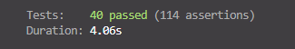
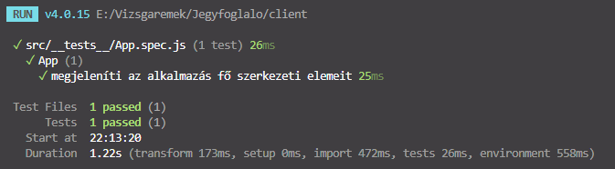
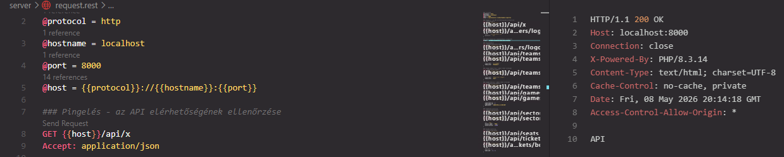
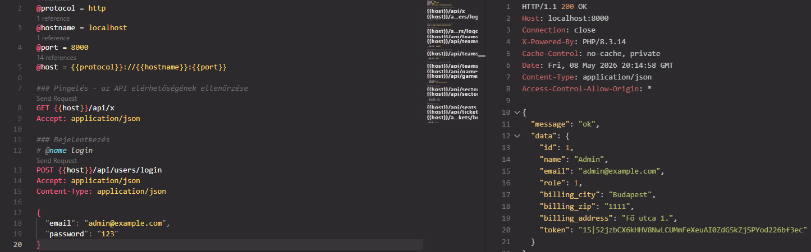

# Jegyfoglaló - Tesztek dokumentációja

Ez a dokumentum a Jegyfoglaló alkalmazáshoz tartozó kézi és automatizált teszteket foglalja össze. Tartalmazza a REST kérések szerkezetét, a backend PHPUnit teszteket, a frontend Vitest és Cypress teszteket, valamint a legutóbbi tesztfuttatások eredményét.

## Tesztkörnyezet

| Terület                | Technológia                | Helye                  |
| ---------------------- | -------------------------- | ---------------------- |
| Backend                | Laravel, PHPUnit           | `server/tests`         |
| Backend kézi API teszt | REST Client / request.rest | `server/request.rest`  |
| Frontend unit teszt    | Vitest, Vue Test Utils     | `client/src/__tests__` |
| Frontend E2E teszt     | Cypress                    | `client/cypress/e2e`   |

## Kézi teszt: pingelés REST kéréssel

A legegyszerűbb kézi teszt azt ellenőrzi, hogy a backend API fut-e.

Futtatás előtt:

```bash
cd server
php artisan serve
```

REST kérés a `server/request.rest` fájlban:

```http
### Pingelés - az API elérhetőségének ellenőrzése
GET {{host}}/api/x
Accept: application/json
```

Elvárt válasz:

```text
API
```

## `request.rest` szerkezete

A `server/request.rest` fájl változókkal indul, hogy ne kelljen minden kérésben külön beírni a szerver címét:

```http
@protocol = http
@hostname = localhost
@port = 8000
@host = {{protocol}}://{{hostname}}:{{port}}
```

A bejelentkezés válaszából a REST Client automatikusan ki tudja emelni a tokent:

```http
# @name login
POST {{host}}/api/users/login
Accept: application/json
Content-Type: application/json

{
  "email": "admin@example.com",
  "password": "123"
}

@token = {{login.response.body.data.token}}
```

Ezután a védett végpontoknál a token így használható:

```http
Authorization: Bearer {{token}}
```

## Bejelentkezés tesztelése

Teszt célja: ellenőrizni, hogy helyes email és jelszó esetén a backend tokent ad vissza.

Mintakérés:

```http
POST {{host}}/api/users/login
Accept: application/json
Content-Type: application/json

{
  "email": "admin@example.com",
  "password": "123"
}
```

Elvárt eredmény:

```json
{
  "message": "ok",
  "data": {
    "token": "..."
  }
}
```

Sikertelen bejelentkezésnél 401-es státuszkód várható.

## Minta CRUD műveletek

Csapat létrehozása:

```http
POST {{host}}/api/teams
Accept: application/json
Content-Type: application/json
Authorization: Bearer {{token}}

{
  "team_name": "Új Csapat",
  "team_city": "Budapest"
}
```

Csapat módosítása:

```http
PATCH {{host}}/api/teams/1
Accept: application/json
Content-Type: application/json
Authorization: Bearer {{token}}

{
  "team_name": "Módosított Csapat",
  "team_city": "Győr"
}
```

Csapat törlése:

```http
DELETE {{host}}/api/teams/1
Accept: application/json
Authorization: Bearer {{token}}
```

## Backend tesztek

A backend tesztek PHPUnit alapúak. A tesztfájlok helye:

```text
server/tests/Unit
server/tests/Feature
```

Futtatás:

```bash
cd server
php artisan test
```

Eredmény fájlba irányítása:

```bash
php artisan test > ../teszt-eredmeny-backend.txt
```

### Unit tesztek

A unit tesztek főleg az adatbázistáblák meglétét, az oszlopokat, az oszloptípusokat, a modellek létrehozását és a kapcsolatok működését ellenőrzik.

Fontosabb tesztfájlok:

| Fájl               | Mit ellenőriz?                                                     |
| ------------------ | ------------------------------------------------------------------ |
| `DatabaseTest.php` | táblák, idegen kulcsok, kapcsolatok, dupla foglalás elleni védelem |
| `UserTest.php`     | user mezők, jelszó hash, admin szerepkör, email egyediség          |
| `TeamTest.php`     | csapat létrehozása és tábla szerkezete                             |
| `GameTest.php`     | hazai és vendég csapat kapcsolata                                  |
| `SectorTest.php`   | szektor létrehozása és mezők                                       |
| `SeatTest.php`     | szék és szektor kapcsolata                                         |
| `TicketTest.php`   | jegy létrehozása, státusz, kapcsolatok                             |

Tipikus unit teszt mintakód:

```php
public function test_team_can_be_created()
{
    $team = Team::create([
        'team_name' => 'Újszász VVSE',
        'team_city' => 'Újszász'
    ]);

    $this->assertDatabaseHas('teams', [
        'team_name' => 'Újszász VVSE'
    ]);
}
```

Magyarázat: a teszt létrehoz egy csapatot, majd ellenőrzi, hogy az adatbázisban valóban megjelent-e.

### Funkcionális tesztek

A funkcionális tesztek azt ellenőrzik, hogy az API végpontok a felhasználói szerepkörök szerint működnek-e.

Példa a `PingTest.php` fájlból:

```php
#[DataProvider('tablesGetDataProvider')]
public function test_api_get_endpoints($route, $email, $password, $expectedStatus): void
{
    $response = $this->login($email, $password);
    $response->assertStatus(200);

    $token = $this->myGetToken($response);
    $response = $this->myGet("/api/$route", $token);

    $response->assertStatus($expectedStatus);
    $this->logout($token);
}
```

Magyarázat: a teszt belépteti a felhasználót, lekéri a tokent, meghív egy API útvonalat, majd ellenőrzi az elvárt HTTP státuszkódot.

### End-point tesztek

A `PingTest.php` több végpontot is ellenőriz:

| Végpont            | Tesztelt működés              |
| ------------------ | ----------------------------- |
| `GET /api/teams`   | csapatok lekérése             |
| `GET /api/sectors` | szektorok lekérése            |
| `GET /api/games`   | mérkőzések lekérése           |
| `GET /api/tickets` | jegyek lekérése tokennel      |
| `GET /api/users`   | admin jogosultság ellenőrzése |
| `POST /api/teams`  | admin létrehozási jogosultság |
| `POST /api/games`  | admin létrehozási jogosultság |

## Backend teszteredmény

Legutóbbi futtatás időpontja: 2026.05.08.

Parancs:

```bash
cd server
php artisan test
```

Összesítés:

```text
Tests: 40 passed (114 assertions)
Duration: 3.99s
```

Sikeres tesztcsoportok:

```text
PASS Tests\Unit\DatabaseTest
PASS Tests\Unit\ExampleTest
PASS Tests\Unit\GameTest
PASS Tests\Unit\SeatTest
PASS Tests\Unit\SectorTest
PASS Tests\Unit\TeamTest
PASS Tests\Unit\TicketTest
PASS Tests\Unit\UserTest
PASS Tests\Feature\ExampleTest
PASS Tests\Feature\PingTest
```

A javított backend tesztek az aktuális migrációkhoz igazodnak:

| Terület         | Ellenőrzött működés                                                        |
| --------------- | -------------------------------------------------------------------------- |
| Szektorok       | `id`, `sector_name`, `sector_price` mezők, string alapú szektorazonosító   |
| Székek          | `game_id`, `sector_id`, sor, oszlop, státusz, valamint a szektor kapcsolat |
| Jegyek          | user, meccs és szék kapcsolat, dupla foglalás elleni egyedi kulcs          |
| API jogosultság | admin írhat/törölhet, sima felhasználó nem fér hozzá admin műveletekhez    |
| Ping végpont    | `GET /api/x` elérhetőségi teszt                                            |

Következtetés: a backend automatizált tesztcsomag sikeresen lefutott, a unit, funkcionális és end-point tesztek zöldek.

## Frontend tesztek

A frontend két teszttípust tartalmaz:

| Teszt fajta | Eszköz                  | Helye                              |
| ----------- | ----------------------- | ---------------------------------- |
| Unit teszt  | Vitest + Vue Test Utils | `client/src/__tests__/App.spec.js` |
| E2E teszt   | Cypress                 | `client/cypress/e2e/example.cy.js` |

### Vitest unit teszt

Futtatás:

```bash
cd client
npm.cmd run test:unit -- --run
```

Eredmény fájlba irányítása:

```bash
npm.cmd run test:unit -- --run > ../teszt-eredmeny-frontend-vitest.txt
```

Mintakód:

```js
it("megjeleníti az alkalmazás fő szerkezeti elemeit", () => {
  const wrapper = shallowMount(App, {
    global: {
      stubs: {
        Menu: true,
        Footer: true,
        ToastContanier: true,
        RouterView: {
          template: '<section data-test="router-view"></section>',
        },
      },
    },
  });

  expect(wrapper.findComponent({ name: "Menu" }).exists()).toBe(true);
  expect(wrapper.find('[data-test="router-view"]').exists()).toBe(true);
  expect(wrapper.findComponent({ name: "Footer" }).exists()).toBe(true);
});
```

Magyarázat: a teszt nem a teljes alkalmazást rendereli, hanem az `App.vue` fő szerkezetét vizsgálja. Ellenőrzi, hogy a menü, a router nézet és a lábléc megjelenik-e.

### Vitest eredmény

Legutóbbi futtatás időpontja: 2026.05.08.

```text
Test Files  1 passed (1)
Tests       1 passed (1)
Duration    1.18s
```

## Cypress E2E teszt

Futtatás:

```bash
cd client
npm.cmd run test:e2e
```

Az E2E script a Vite fejlesztői szervert indítja a `4173`-as porton, majd ezen futtatja a Cypress tesztet:

```json
"test:e2e": "start-server-and-test 'vite dev --port 4173' http://localhost:4173 'cypress run --e2e'"
```

Fejlesztői, böngészős futtatás:

```bash
npm.cmd run test:e2e:dev
```

Mintakód:

```js
describe("Jegyfoglaló felület", () => {
  it("betölti a főoldalt", () => {
    cy.visit("/");
    cy.contains("h1", "Welcome to TicketMaster!");
    cy.contains("a", "Buy Tickets").should("be.visible");
  });
});
```

Magyarázat: az E2E teszt böngészőben nyitja meg az alkalmazást, majd ellenőrzi, hogy a főoldali cím és a jegyvásárlás link látható-e.

### Cypress eredmény

Legutóbbi futtatás időpontja: 2026.05.08.

Az E2E futtatásnál a Vite dev szerver sikeresen elindult:

```text
VITE v7.2.7 ready
Local: http://localhost:4173/
```

A Cypress futtatás a helyi Cypress bináris hibája miatt nem jutott el a teszt végrehajtásáig:

```text
Cypress failed to start.
Cypress.exe: bad option: --smoke-test
Cypress.exe: bad option: --ping=406
```

Következtetés: a Cypress E2E tesztkód és a futtatási script elkészült, de ezen a gépen a Cypress cache-ben lévő bináris hibás. A backend és a frontend unit tesztek ettől függetlenül sikeresen lefutnak.

## Teszt lefutási képernyőkép dokumentálása

A tesztfuttatásokról képernyőképet kell készíteni, majd a `screenshots/` mappába érdemes menteni.

Javasolt fájlnevek:

```text
screenshots/backend-phpunit-result.png
screenshots/frontend-vitest-result.png
screenshots/rest-ping-result.png
screenshots/rest-login-result.png
```

A dokumentációban ezek így hivatkozhatók:









## Összegzés

A projektben a tesztelés három szinten jelenik meg:

1. Kézi API tesztelés `request.rest` fájllal.
2. Backend automatizált tesztek PHPUnit segítségével.
3. Frontend unit és E2E tesztek Vitest, illetve Cypress használatával.

A frontend unit teszt és a backend PHPUnit tesztcsomag jelenleg sikeresen lefut. A Cypress E2E teszt mintakód és futtatási script elkészült, de a helyi Cypress bináris hibája miatt ezen a gépen még nem futott végig.
